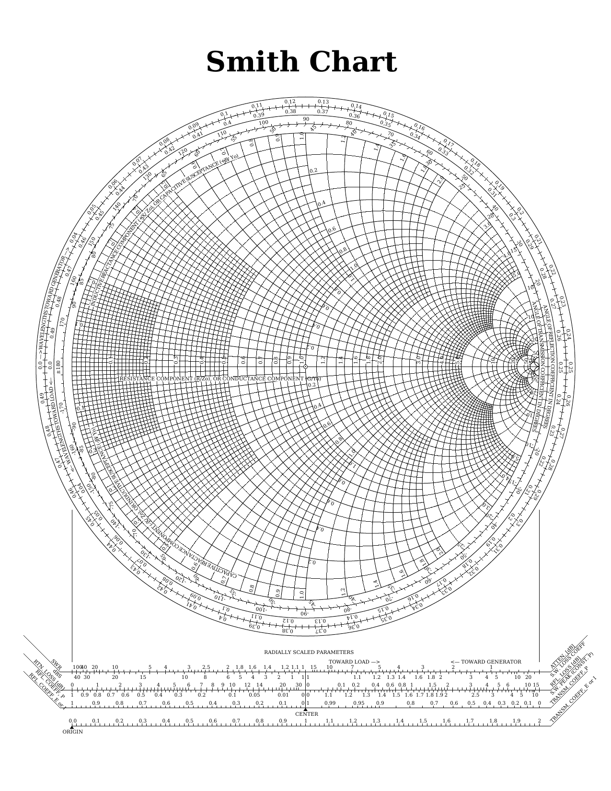

# SmithChart
The Smith chart, is a graphical calculator designed for electrical and electronics engineers specializing in radio frequency (RF) engineering to assist in solving problems with transmission lines and matching circuits. [See more ](https://en.wikipedia.org/wiki/Smith_chart)

 
